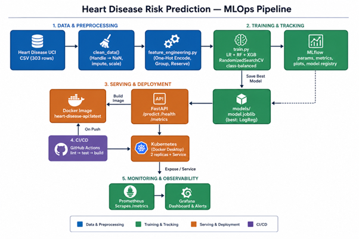

# Heart Disease Risk — MLOps Pipeline (AIMLCZG523 Assignment 01)

## Setup
```bash
python -m venv venv && source venv/bin/activate   # Windows: venv\Scripts\activate
pip install -r requirements.txt
```
## Below is the architecture diagram  



## 1. Get the data
```bash
python data/download_data.py
```
Fetches the Cleveland subset (303 rows, 14 columns) from a GitHub mirror of
the UCI Heart Disease dataset. A verified copy already ships in `data/heart.csv`,
so this step is optional. The script also converts the known invalid encodings
in this mirror (`ca=4`, `thal=0`) to NaN so imputation handles them.

## 2. EDA
```bash
python src/eda.py
```
Outputs land in `eda_outputs/`.

## 3. Train + track experiments
```bash
mlflow ui &   # http://localhost:5000
python src/train.py
```
Trains Logistic Regression, Random Forest, and XGBoost with
RandomizedSearchCV, with class weighting (class_weight='balanced' for LR/RF,
scale_pos_weight for XGBoost) computed from the training split. Logs
params/metrics/plots/model to MLflow for all three,
and saves the best pipeline to `models/model.joblib`.

### Personalization choices 
- **Feature engineering** (`src/feature_engineering.py`): `age_group` bins,
  `chol_bp_ratio`, `hr_reserve` (220 - age - thalach) — computed identically
  at training and inference time (see `api/main.py`), which is the part most
  builds get wrong.
- **Third model**: XGBoost, not just LR + RF.
- **Tuning**: RandomizedSearchCV across all three models instead of
  GridSearchCV.
- **EDA**: ranked target-correlation bar chart + engineered-feature violin
  plot, beyond the four mandatory plot types.
- **Monitoring**: a real `/metrics` Prometheus endpoint (request counter by
  outcome + latency histogram) wired into the API itself, not a
  bolt-on side-service.

## 4. Run the API locally
```bash
uvicorn api.main:app --reload
# POST http://localhost:8000/predict
```

## 5. Tests
```bash
pytest tests/ -v
```

## 6. Docker
```bash
docker build -t heart-disease-api .
docker run -p 8000:8000 heart-disease-api
```

## 7. Kubernetes (Minikube example)
```bash
minikube start
eval $(minikube docker-env)
docker build -t heart-disease-api:latest .
kubectl apply -f k8s/deployment.yaml
kubectl apply -f k8s/service.yaml
minikube service heart-disease-api-service
```

## 8. CI/CD
Push to GitHub — `.github/workflows/ci.yml` lints, tests, and builds the
Docker image automatically.

## 9. Monitoring
API logs every request/response, and exposes real Prometheus metrics at
`/metrics` (request count by outcome, prediction latency histogram). Point a
local Prometheus instance at it:
```yaml
scrape_configs:
  - job_name: 'heart-disease-api'
    static_configs:
      - targets: ['localhost:8000']
```

